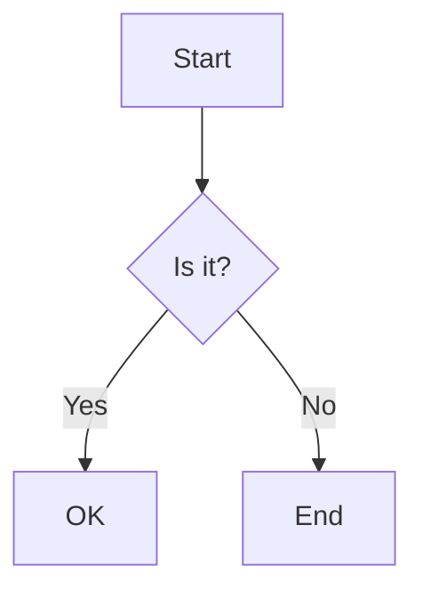

# Welcome to the CTF-Kit Repository

🌐 **Live Site**: [https://cywf.github.io/ctf-kit/](https://cywf.github.io/ctf-kit/)

## Introduction

Welcome to the CTF-Kit repository! This project is designed to be a collaborative and evolving resource for anyone interested in participating in Capture The Flag (CTF) competitions. Whether you're a seasoned veteran or a newcomer to the world of CTFs, this repository aims to provide you with the tools, resources, and knowledge you need to succeed.

## Vision and Goals

### Our Vision
The vision for this repository is to become a central hub for CTF learning and collaboration. We aim to create a dynamic space where participants can share their insights, strategies, and resources to help each other improve and grow. By working together, we can continuously refine our approaches to CTF challenges and build a comprehensive database of scripts, writeups, and tools that benefit everyone.

### Goals
- **Facilitate Collaboration**: Encourage participants to work together, share their findings, and contribute to the collective knowledge base.
- **Improve CTF Strategies**: Through shared experiences and resources, help users develop more effective strategies for tackling various types of CTF challenges.
- **Create a Rich Database**: Build a repository of scripts, tools, and writeups that serve as valuable references for future CTFs.

## How to Use This Repository

### Getting Started
1. **Fork the Repository**: Start by forking this repository to your own GitHub account.
2. **Create a Branch**: When you participate in a CTF, create a new branch in your forked repo. Name the branch after the CTF event you are participating in (e.g., `metactf-august2024`).
3. **Work in Your Branch**: Use this branch to document your progress, add scripts, and write up your solutions.
4. **Contribute Back**: After the CTF, you can submit a pull request to contribute your findings and improvements back to the main repository.

### Collaboration and Contribution
This repository thrives on collaboration. Whether you've developed a new script, discovered a better way to solve a challenge, or written a detailed writeup, your contributions are valuable. To contribute:
- **Submit a Pull Request**: Once your branch is ready, submit a pull request to merge your changes into the main branch.
- **Share Your Knowledge**: Add new documentation, tools, or improvements to existing resources. Your contributions help everyone in the community.

## Repository Structure

### Docs Directory
The `docs` directory contains all the documentation you need to get started, including the CTF Starter Guide, tool lists, and more. Each document is also available as a wiki page for easier access. Feel free to explore and contribute to this documentation as you gain more experience.

### Scripts and Tools
This repository includes a collection of scripts and tools that can help you solve various CTF challenges. You can find them in the `scripts` directory. Each script comes with documentation on how to use it. If you have scripts of your own that you'd like to share, please add them here!

### Branches and Workflows
We use a branch-per-CTF strategy to track progress and improvements over time. Here’s how it works:
- **Naming Conventions**: Name your branch after the CTF event you’re participating in.
- **Merging**: After your CTF is complete, submit a pull request to merge your branch into the main repository.
- **GitHub Actions**: We will be setting up GitHub Actions to help automate the review and merging process, ensuring that contributions are properly integrated into the main branch.

## Contributing to the Repository

### How to Contribute
We welcome contributions from everyone! Here’s how you can get involved:
- **Create a Branch**: As mentioned, create a new branch for each CTF event.
- **Submit Pull Requests**: After making your changes, submit a pull request to contribute back to the main repository.
- **Write Documentation**: If you have tips, strategies, or insights, please add them to the documentation.

### Collaboration
This repository is all about collaboration. By working together, we can all improve our skills and knowledge. Engage with other contributors through pull requests, discussions, and issues to share your experiences and learn from others.

## Future Plans and Roadmap

### Ongoing Development
We’re constantly working to improve this repository. Here’s what’s coming next:
- **New Tools and Scripts**: We’ll be adding more tools and scripts to help with a wider variety of challenges.
- **Enhanced Documentation**: Ongoing efforts to improve the documentation and add new guides.
- **GitHub Actions**: Automating the review process to streamline contributions.

### Roadmap
We have a planned roadmap for future updates and features. You can check out the project board to see what’s coming next. We also welcome suggestions from the community—if there’s something you’d like to see added, let us know!

### Call for Suggestions
Your input is valuable! If you have ideas for new features, tools, or improvements, please open an issue or start a discussion. We want this repository to be as useful as possible, and your suggestions can help us get there.

## Conclusion

Thank you for being a part of the CTF-Kit community! Whether you’re here to learn, contribute, or both, we’re excited to have you with us. This repository is a living project that grows and improves with each contribution, so don’t hesitate to get involved. Fork the repo, create your branch, and start tackling those CTFs!

## Contributing to the Documentation

### Adding Documentation
Documentation files are stored in the `/docs/` directory and are automatically rendered on the [live site](https://cywf.github.io/ctf-kit/docs). To add or update documentation:

1. Create or edit markdown files in `/docs/` or subdirectories
2. Use clear headings and formatting
3. Submit a pull request with your changes
4. The site will automatically update when changes are merged to main

### Adding Mermaid Diagrams
Visual diagrams help explain complex concepts and workflows. To add a diagram:

1. Create a `.mmd` file in the `/mermaid/` directory (create this directory if it doesn't exist)
2. Write your diagram using [Mermaid syntax](https://mermaid.js.org/intro/)
3. Commit and push your changes
4. The CI workflow will process the diagram and make it available on the [visualizer page](https://cywf.github.io/ctf-kit/visualizer)

Example diagram structure:

## How the Site Works

### CI/CD Pipeline
Our GitHub Actions workflow automatically:
1. Fetches live repository statistics (stars, forks, languages, commits)
2. Retrieves discussions from GitHub Discussions
3. Syncs project board items or falls back to issues
4. Indexes scripts with descriptions from comments
5. Builds and deploys the site to GitHub Pages

### Data Snapshots
The site uses JSON data snapshots created during the CI build:
- `stats.json` - Repository metrics and activity
- `discussions.json` - Latest community discussions
- `projects.json` - Development board status
- `scripts.json` - Available scripts with descriptions

These snapshots are generated server-side and consumed client-side for optimal performance.
